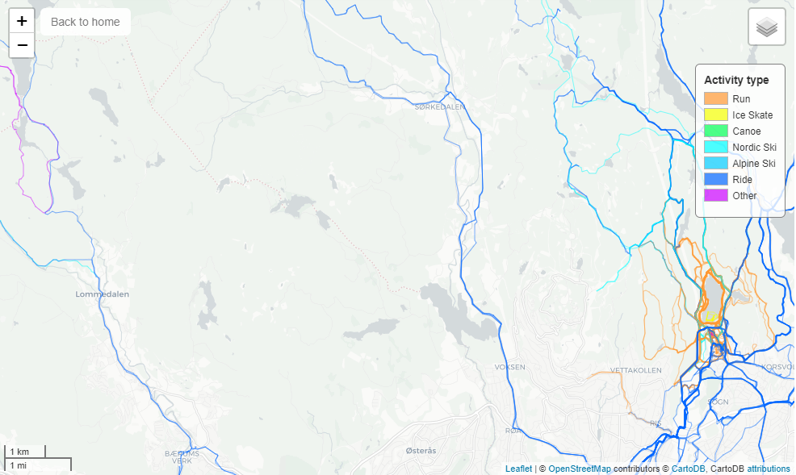

<a href="https://www.strava.com/">
    
</a>

# A personal Strava Heatmap
[](https://dev.azure.com/rafaelschlatter/strava-heatmap/_build/latest?definitionId=17&branchName=master)
[](https://github.com/psf/black)

## 1. About
A Flask web app that contains a heatmap from GSP data from my Strava activities: <http://my-heatmap.azurewebsites.net/>.

The app runs a gunicorn server in a Docker container on Azure app service. The map is updated by an Azure pipeline, which runs a Python script that queries the Strava API to get coordinates from my activities and creates a map in HTML format. That file and the rest of the code are used to build & push an image to Docker Hub. The image (with the most recent map) is  deployed daily to the app service.



## 2. Development
Requirements:
- Python 3.7 (i use 3.7 because the Azure app service that hosts this runs 3.7, but 3.5+ should also work)
- Docker & an account at Docker hub
- Azure subscription
- Account at Google reCAPTCHA

Create a virtual environment and install the dependencies:
````bash
pip install virtualenv
virtualenv venv # venv or env are common names for virtual environments
venv\scripts\activate # or source venv\bin\activate on mac/linux
pip install -r requirements.txt
````

The following environment variables are required to make use of all functionality:
- `STRAVA_CLIENT_ID`
- `STRAVA_CLIENT_SECRET`
- `STRAVA_REFRESH_TOKEN`
- `GMAIL_ADRESS`
- `GMAIL_PW`
- `RECAPTCHA_USE_SSL`
- `RECAPTCHA_PUBLIC_KEY`
- `RECAPTCHA_PRIVATE_KEY`

You can run the app locally by running these two commands sequentially (you might want to change the `host` and `port` when calling `app.run()`):
````bash
python scripts/create_heatmap.py # this might take a couple of minutes
python application.py
````
This is running a flask web server for development, you should not run this in production. 

## 3. Deployment with Docker & Azure app service
### 3.1 Build & push a container
It is easiest to deploy the app as a docker container. The container will start a gunicorn web server to run the application. Build and push the Docker image with the following commands:
````bash
docker login
docker build -t <your_docker_user>/stravaheatmap:latest .
docker push <your_docker_user>/stravaheatmap:latest
````

Running & testing the container locally (passing environment variables with `-e`). This runs a gunicorn server, which can be used in production:
````bash
docker run -p 5000:8080 -e SECRET_KEY=<your_secret_key> \
  -e GMAIL_ADRESS=<your_gmail_adress> -e GMAIL_PW=<your_gmail_pw> \
  -e RECAPTCHA_PRIVATE_KEY=<your_private_key> -e RECAPTCHA_PUBLIC_KEY=<your_public_key> \
  <your_docker_user>/stravaheatmap:latest
````

Point a browser to <http://localhost:5000/> to see the containerized app running.

### 3.2 Host it on an Azure app service
- Login to Azure and create a web app (app service), choose Docker container as publish and Linux as the operating system (gunicorn does not run on Windows) in the basics tab
- In the Docker tab, choose single container and Docker Hub as the image source, choose public access type and provide the image name and tag (this includes your docker user name, e.g. `<your_docker_user>/stravaheatmap:latest`), no need to provide a startup command, since the Dockerfile already contains that
- The remaining settings are up to you, click "Review and create"
- Once created, in the container settings of your app service, enable continuous deployment

If you update the image on Docker Hub, you need to restart the app service to pull the latest image.

## 4. License
This project is licensed under the the MIT license. See [LICENSE](LICENSE.txt) for details.
